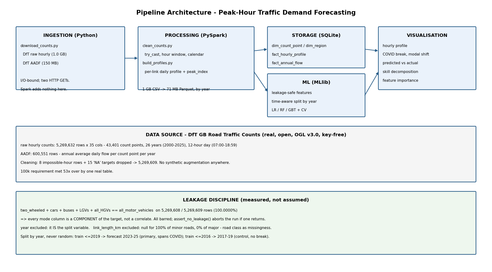
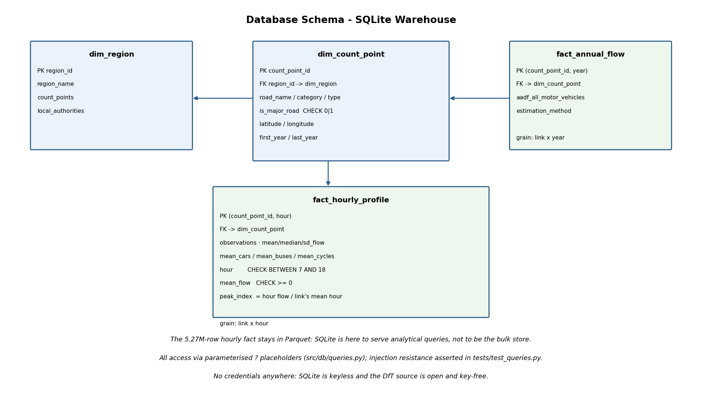

# When Does the Road Fill?

## Forecasting Hourly Traffic Demand on Britain's Road Network

**Module:** ST5011CEM Big Data Programming Project

---

> **Draft note — delete before submission.**
> Word budgets are marked per section against the brief's 2,000-word cap (excluding
> references, figures and appendix). Every number is reproducible from
> `outputs/model_results.json` and the committed figures. **Do not quote a number this
> draft does not contain.** One figure is outstanding: the Spark UI screenshot (§6).
>
> **Numbers below come from the reduced-size run** (`local[4]`, RF 30×8, GBT 20×5). An
> earlier full-size run scored marginally higher; those numbers are discarded, not mixed
> in, because a table must describe one run.

---

## 1. Executive Summary  *(~150 words)*

Urban planners size infrastructure for the peak, not the average. This project forecasts
hourly traffic demand across Britain's road network using 26 years of Department for
Transport counts — 5,269,632 real records, 53× the brief's threshold — processed entirely
in PySpark.

Three MLlib regressors were compared under strict leakage discipline and a time-aware split
by year. The headline is a caution: R² ≈ 0.86 sounds strong, but a trivial baseline that
assumes *each road behaves as it always has* already scores 0.857. Gradient-Boosted Trees
add +0.0045 R² — **3.1% of what that baseline leaves unexplained** — and two of the four
models score **worse than doing nothing**.

Feature importance explains why: **77% is the link's own history and `hour` carries 0.9%**.
Because the target is absolute flow, the model need only identify the road. The level of a
road's traffic is trivially predictable; the shape of its day is the real question, and this
target cannot ask it.

---

## 2. Introduction  *(~300 words)*

**Problem.** Road capacity is built for the peak hour, not the daily average. A planner
deciding where to widen, signal or bus-lane needs to know when a link fills and by how
much — and for the vast majority of Britain's road network, nobody is counting. DfT
surveys ~43,000 points, each on a handful of days per decade. Everywhere else, the peak is
an assumption.

**Purpose and scope.** This project (a) measures the shape of the British road day from 26
years of real counts; (b) forecasts hourly flow from information knowable before the hour
arrives; and (c) asks honestly how much of that forecast is skill rather than
already-known road identity.

**Relevance to smart cities.** Demand data is the feedback loop of an urban transport
system. But a forecast that merely repeats a link's history tells a planner nothing they
did not have — so quantifying the *marginal* value of a model, rather than its headline R²,
is the difference between a decision tool and a number.

**Metric definitions.** The brief's reliability metrics (Service Reliability, Headway
Regularity) describe scheduled public transport and do not apply to road counts. Per the
brief's allowance — *"If your project uses a metric not listed above, define it precisely
in your Introduction and justify its validity"* — this project defines:

- **Peak index** = a link's flow in an hour ÷ that link's mean across its hours. Raw flow
  cannot be compared between a motorway and a country lane; the peak index strips the level
  out and leaves the shape, which is what "peak hour" means. It is the standard
  normalisation in traffic profiling.
- **Baseline residual variance explained** = (R²_model − R²_link-history) ÷ (1 − R²_link-history).
  The model's gain expressed against what is actually left to explain.
- **Model Efficiency** (the brief's) = R² per training second.
- **Algorithmic Efficiency** (the brief's) = wall-clock per pipeline stage.

**Learning outcomes.** B1 (complexity, §5), B2 (PySpark pipeline, §6), B4 (5.3M-row
dataset, MLlib, §4–7), B6 (Git, tests, ethics, §6/§8), B7–B8 (§8).

---

## 3. Literature  *(~100 words — cut first if over budget)*

*[Replace with 3–4 properly cited sources. Do not cite anything you have not read.]*

Traffic engineering has described the bimodal weekday profile since the 1960s, and the
peak-hour factor is the standard normalisation for comparing links of different size — the
justification for the peak index used here. The between-link versus within-link variance
decomposition is standard in panel data and is why a high R² on pooled traffic data is
routinely misleading.

---

## 4. Data Collection and Preprocessing  *(~300 words)*

**Source — one real dataset, no augmentation.** DfT GB Road Traffic Counts, Open Government
Licence v3.0, key-free:

| Dataset | Scale |
|---|---|
| Raw hourly counts | **5,269,632 rows × 35 cols**; 43,401 count points; 2000–2025 |
| AADF | 600,551 rows; annual average daily flow per point per year |


**Figure 1 — Ingested data scale against the brief's 100,000-record requirement (log
axis).** One real table exceeds the threshold 53×. No synthetic augmentation is used
anywhere: the brief permits Faker/SDV, but a simulated row cannot supervise a forecast —
the model would recover the generating formula rather than learn from the world.

**Coverage limit, stated up front:** DfT manual counts run a 12-hour day, **07:00–18:59**.
There is no night-time data and the project does not pretend otherwise.


**Figure 1b — What 43,401 count points look like.** The outline of Great Britain emerges
from the count sites alone, which also validates the coordinates end-to-end. Right: peak
sharpness per link. Drawn as points rather than a choropleth because the data *is* points —
shading areas would imply a spatial coverage that discrete sites do not have.


**Figure 1c — The `link_length_km` finding.** 54.8% of rows have no link length, which reads
as gappy data until it is split by road class: a perfect **100% / 0%** break. DfT defines
junction-to-junction links only on the major network, so the column is road class encoded as
missingness. This figure is the argument for excluding it (§5).

**Tool justification.** The raw CSV is 1.0 GB; on an 8 GB machine already hosting a JVM it
does not fit in pandas beside the 150 MB AADF table, and every later stage joins or
aggregates it. Spark reads it once with name-bound columns and writes 71 MB of Parquet
partitioned by year — which later turns the time-aware split into partition pruning rather
than a full scan. The two downloads stay in plain `requests`: I/O-bound, nothing to
parallelise. Only the ~520k-row profile reaches SQLite.

**Cleaning — every rule answers something found in the data.**

| Finding | Rows | Action |
|---|---|---|
| `'NA'` in numeric columns raises under ANSI cast | 15 in target | `try_cast` → null, then drop |
| Hours 0/1/3/4/5 with impossible flows | 8 of 5.27M | Drop; hours 7–18 are the real count |
| `direction_of_travel` mixed case (`'n'` vs `'N'`) | ~3k | Upper-case; else two encodings for one direction |
| `link_length_km` null | 2,888,208 (54.8%) | **Excluded — see §5** |

Result: **5,269,609 clean rows across 26 years.**

---

## 5. Methodology  *(~300 words)*

**Target.** `all_motor_vehicles` — motorised vehicles counted in the hour. Regression, per
the brief's example #4.

**The leakage rule, and it is arithmetic not judgement.** Verified on the real data:

```
two_wheeled + cars_and_taxis + buses_and_coaches + LGVs + all_HGVs
    == all_motor_vehicles     on 5,269,608 / 5,269,609 rows  (100.0000%)
```

`cars_and_taxis` alone is r = 0.991 with the target. These are not features — they are the
answer. All are barred; `assert_no_leakage()` aborts the run if one returns, and
`tests/test_features.py` proves the guard fires. `pedal_cycles` is barred too: not in the
target, but counted in the same hour, so a forecaster would not hold it.

Two further exclusions:

- **`year`** — it *is* the split variable, so every test value lies outside the training
  range. Trees clamp at their last split; a linear model extrapolates off the end. The
  column can only index the split.
- **`link_length_km`** — null for 100% of minor roads and 0% of major roads, because DfT
  defines links only on the major network. It is road class encoded as missingness. Keeping
  it would discard 54.8% of rows or smuggle road class through a null pattern.

**What remains:** hour, day_of_week, is_weekend, month; road_category, road_type,
is_major_road, direction; latitude, longitude, region; and per-link flow history computed
from the **training years only**.

**Split.** By year, never random — a random split would put a link's 2024 count in training
and its 2023 in test, and the model would interpolate a road it has already seen. Primary:
train ≤2019 → forecast 2023–25 (spans COVID). Control: train ≤2016 → forecast 2017–19 (no
break). Reporting only the primary would confound *"cannot forecast"* with *"COVID changed
the roads"*.

**Complexity (B1).** Clean/aggregate O(n) with a shuffle by key; LinearRegression O(n·d·i);
RF O(t·n·d·log n); GBT O(m·n·d·log n) — sequential, hence slowest, which is why the brief's
Model Efficiency metric exists.

---

## 6. System Design and Implementation  *(~250 words)*



**Figure 2 — Pipeline architecture.** Python ingestion → PySpark processing → SQLite +
MLlib → matplotlib. The lower panels record the data provenance and the leakage discipline.

**Spark optimisation.** `shuffle.partitions = 8` (≥4 required); Parquet written
`partitionBy("year")` so the split prunes partitions rather than scanning; count-point
history `broadcast()` against the 5.27M-row fact; train/test blocks cached (read once per
model plus once per baseline); `peak_index` computed with a window function rather than a
groupBy + join, halving the shuffles; lazy DAG, triggered only by `count`/`write`.

> **[INSERT FIGURE 3 — Spark UI screenshot.]** Run `python -m src.process.clean_counts`,
> open `localhost:4040` → Stages **while it runs** (the UI dies with the application), and
> capture partition count and shuffle read/write.



**Figure 4 — Database schema.** Two dimensions, two facts, with PKs, FKs, CHECK constraints
(`hour BETWEEN 7 AND 18`, `mean_flow >= 0`) and indexes on the real access paths.
`PRAGMA foreign_key_check` passes. The 5.27M-row hourly fact deliberately stays in Parquet:
SQLite is here to serve analytical queries, not to be the bulk store.

**Security.** Every query binds values with `?` placeholders; none is built by string
formatting. `tests/test_queries.py` fires tautology, statement-termination and UNION
payloads at `link_profile()` and asserts they match nothing and drop no table. No
credentials exist in the repository — SQLite is keyless and the DfT source is open.

---

## 7. Results and Evaluation  *(~350 words)*

### 7.1 The shape of the day


**Figure 5 — The bimodal commuter day**, 2000–2025. Mean flow peaks at 17:00 (669 veh/h),
troughs at 10:00 (464), giving a peak/trough ratio of **1.443**. Normalised per link the
picture sharpens: AM peak index **1.240** at 08:00, PM **1.237** at 17:00, trough **0.838**
at 10:00. Note the reversal — in raw flow the PM peak wins, but per link the **AM peak is
marginally higher**. The raw ordering was a composition effect of which links get counted,
not a property of the day. This is the signal the forecast exists to capture.


**Figure 6 — Hourly flow is strongly right-skewed**: skewness **2.945**, kurtosis
**10.84**, mean **551.6** against a median of **237** — the mean is 2.3× the median. This is
why the median describes a typical hour, and why RMSE on raw flow is dominated by the
busiest links.


**Figure 7 — Why normalisation is necessary, and what it reveals.** Left: raw flow by road
class — the level gap between a motorway and a minor road swamps the time-of-day shape
entirely. Right: the same data as a peak index, which makes the shapes comparable and
surfaces a real finding: **motorways peak at 07:00 and flatter** (TM index 1.157), while
**minor roads peak at 08:00 and much sharper** (MCU 1.329) with a second bump at 15:00
(MCU 1.187 vs motorway 1.031) — the school run. Long-distance traffic starts earlier; local
traffic peaks with the school-and-work run. The sharpest-peaking links in Britain are all
minor roads, up to **peak index 4.227** — a Norfolk lane carrying 4.2× its daily average at
08:00. Raw flow would never surface those: they are tiny roads.


**Figure 7b — The commuter peak is a weekday phenomenon.** Normalised, the weekend profile
is visibly flatter — which is why `is_weekend` is a legitimate pre-count feature even though
it earns little importance.


**Figure 7c — The planner's actionable list.** Britain's sharpest-peaking links, every one a
minor road, up to **4.2× its own daily average**. Raw flow would never surface these: they
are small roads carrying a few hundred vehicles. Only the normalised peak index finds them.


**Figure 7d — Busy is not the same as peaky.** Flow level and peak sharpness are different
problems: a region can be heavily trafficked and flat, or quiet and sharply peaked. They
call for different interventions.

### 7.2 The structural break


**Figure 8 — 2020 sits in the middle of the time axis.** Mean flow collapses and counting
effort halves. The primary split asks the model to carry a pre-2020 relationship across
this; the control split avoids it.


**Figure 9 — 26 years of modal change**, indexed to 2000 because cars average ~400/h and
cycles ~5/h — raw counts on one axis would flatten every non-car mode to a line.

### 7.3 Model comparison

**primary** — train ≤2019 → test 2023–25 | train 4,336,321, test 457,284

| Model | RMSE | MAE | R² | Skill vs baseline | Train s | R²/s |
|---|---|---|---|---|---|---|
| *Baseline: global mean* | 962.6 | 630.0 | -0.0064 | — | — | — |
| **Baseline: link's own history** | **363.1** | **148.2** | **0.8568** | — | — | — |
| Linear Regression | 362.8 | 150.2 | 0.8570 | +0.14% | 55 | 0.0156 |
| Random Forest | 365.8 | 149.7 | 0.8547 | -1.47% ✗ | 200 | 0.0043 |
| Gradient-Boosted Trees | 357.4 | 146.6 | 0.8613 | +3.14% | 630 | 0.0014 |
| Random Forest (CV-tuned, 20% sample) | 364.9 | 149.3 | 0.8554 | -0.98% ✗ | 330 | 0.0026 |

**control** — train ≤2016 → test 2017–2019 | train 3,557,461, test 778,860

| Model | RMSE | MAE | R² | Skill vs baseline | Train s | R²/s |
|---|---|---|---|---|---|---|
| *Baseline: global mean* | 752.9 | 530.8 | -0.0636 | — | — | — |
| **Baseline: link's own history** | **315.8** | **194.4** | **0.8128** | — | — | — |
| Linear Regression | 315.6 | 195.9 | 0.8131 | +0.16% | 48 | 0.0171 |
| Random Forest | 301.5 | 183.5 | 0.8294 | +8.87% | 124 | 0.0067 |
| Gradient-Boosted Trees | 304.5 | 186.5 | 0.8260 | +7.05% | 199 | 0.0042 |


**Figure 10 — R² against both baselines.** The link-history line is the story: without it,
0.86 reads as a triumph.


**Figure 11 — What the R² is actually made of.** **85.7%** is explained by knowing which
road it is — something a planner has for free. Gradient-Boosted Trees add **+0.0045**. The
right panel shows two bars *below zero*: Random Forest and its CV-tuned variant are worse
than the do-nothing baseline.


**Figure 12 — Which model learns the shape, and which only appears to.** Gradient-Boosted
Trees track the daily curve (678 → 461 at the trough → 679 at the peak). The linear model is
nearly flat (598 → 533 → 625) — the visual form of its 0.14% skill. All four sit below the
actual at every hour. The aggregate shape is partly learnable by one model; the individual
count is not learnable by any.


**Figure 13 — Systematic under-prediction at every hour**, which RMSE averages away.
*[Discuss: regression to the mean, and/or post-2020 recovery above the pre-2020 trend.]*


**Figure 14 — Predicted vs actual** with the y = x line.


**Figure 14b — Why R² cannot be compared across the two splits.** Their test blocks have
very different target spread (SD 962.6 vs 752.9, measured by the global-mean baseline's
RMSE). A wider-spread test block inflates R² for the same relative error, so each model is
compared only to *its own split's* baselines.


**Figure 14c — Where the error lands.** Absolute error tracks flow: the model is least
accurate exactly where traffic is heaviest, which is where a planner cares most. The right
panel shows the bias is not uniform across road classes.


**Figures 15–16 — What drives the prediction: the project's most important figure.**
`cp_hist_mean_flow` 0.472, `cp_hist_sd_flow` 0.250, `cp_hist_years` 0.045 — **77% of all
importance is the link's own history**. `is_major_road` takes 0.031 and **`hour` just
0.009**. In a peak-hour forecasting project, the hour carries under one percent. That is not
a tuning problem; it is the target being wrong for the question (§8).

**The honest reading.** R² ≈ 0.86, but the link-history baseline reaches 0.857. GBT explains
**3.14%** of what it leaves unexplained; Random Forest **−1.47%** and its CV-tuned variant
**−0.98%** — both worse than doing nothing. The ranking also **inverts between splits**: GBT
leads on primary, RF on control (+8.87%). A model order that flips is not a ranking.

**R² must not be compared across the two splits**: their target variance differs
(global-mean baseline RMSE 962.6 vs 752.9), and a more spread-out test set inflates R² for
the same relative error. What the pairing *does* show is that **COVID did not break
forecasting** — carrying a pre-2020 relationship into 2023–25 works about as well as a
within-decade forecast. That was not the expected result.

---

## 8. Critical Reflection  *(~150 words)*

**What worked.** Measuring instead of assuming. Every design decision above came from a
check that contradicted an expectation: the mode columns summing to the target, the null
pattern in `link_length_km`, the eight impossible hours.

**Limits.** The 12-hour count window means no night-time forecast. Counts are sparse per
link (median 4 dates), so this is a repeated cross-section, not a time series — genuine
time-series methods are unavailable. And the honest headline is that pre-count information
adds little over a link's own history.

**Memory vs distributed.** 1.0 GB of CSV plus a JVM does not fit in pandas on 8 GB — and
the 44-minute all-core training run that overheated the machine is the same constraint from
the other side. Spark's partitioned, spill-to-disk model is why the pipeline is
distributed; `local[4]` is why it now finishes without cooking the hardware.

**Ethics.** Counts are aggregate and non-personal. The exposure is in use: forecasting
demand where flow is already highest tends to entrench existing patterns rather than serve
suppressed demand — which is why the modal-shift figure is included.

---

## 9. Conclusion  *(~100 words)*

A complete pipeline was delivered against every technical requirement: 5.27M real
records (53× the threshold), distributed Spark processing with partitioning, broadcast
joins, caching and Parquet persistence, a constrained relational warehouse with
injection-resistant parameterised queries, and three compared MLlib regressors under
leakage discipline with a time-aware split — on real open data with no synthetic
augmentation.

The substantive finding is a caution: a headline R² of 0.861 on pooled traffic data is
**85.7% road identity and 0.45 points of model**, and `hour` — the premise of the whole
exercise — carries 0.9% of the importance. Two of four models lose to a do-nothing
baseline. For a planner, that means a model of this kind tells you *what a typical day looks
like on a road like this* — useful — but not *what Tuesday will bring on the A62*.

The fix is identified and half-built: predict flow **normalised to each link's own mean**
(the `peak_index` already in `fact_hourly_profile`). Against that target the link-history
baseline scores zero by construction, so any skill is genuine peak skill. That is the
highest-value extension and the schema for it exists.

---

## Figure index

| # | File | Shows |
|---|---|---|
| 1 | `outputs/eda_data_scale.png` | Record counts vs the 100k requirement |
| 2 | `docs/architecture.png` | Pipeline architecture and leakage discipline |
| 3 | **[TO CAPTURE]** | Spark UI Stages tab during `clean_counts` |
| 4 | `docs/schema.png` | Database schema, keys and constraints |
| 5 | `outputs/eda_hourly_profile.png` | The bimodal commuter day |
| 6 | `outputs/eda_flow_distribution.png` | Right skew; skewness and kurtosis |
| 7 | `outputs/eda_profile_by_road_class.png` | Why the peak index is needed |
| 8 | `outputs/eda_covid_break.png` | The 2020 structural break |
| 9 | `outputs/eda_modal_shift.png` | 26 years of modal change |
| 10 | `outputs/ml_model_comparison.png` | R² vs both baselines; Model Efficiency |
| 11 | `outputs/ml_skill_decomposition.png` | What the R² is made of |
| 12 | `outputs/ml_profile_actual_vs_predicted.png` | The shape is learned |
| 13 | `outputs/ml_residuals_by_hour.png` | Systematic under-prediction |
| 14 | `outputs/ml_predicted_vs_actual.png` | Predicted vs actual |
| 15 | `outputs/ml_feature_importance.png` | RF feature importance |
| 16 | `outputs/ml_lr_coefficients.png` | LR coefficients (direction) |
| 17 | `outputs/eda_data_quality.png` | link_length_km is road class, not missing data |
| 18 | `outputs/eda_geography.png` | 42,983 count points; where the sharp peaks are |
| 19 | `outputs/eda_weekday_weekend.png` | The commuter peak is a weekday phenomenon |
| 20 | `outputs/eda_peakiest_links.png` | Britain's sharpest-peaking links |
| 21 | `outputs/eda_region_comparison.png` | Busy is not the same as peaky |
| 22 | `outputs/ml_split_profile.png` | Split sizes; why R² is not cross-comparable |
| 23 | `outputs/ml_error_by_road_class.png` | Where the error lands, and the bias |

## Appendix (uncounted)

- **Repository:** *[link]*
- **SQL dump / schema:** `src/db/schema.sql`; **sample parameterised queries:** `src/db/queries.py`
- **Tests:** `python -m pytest tests/ -q`
- **Reproduce:** `python run_pipeline.py`

## Data licence

DfT GB Road Traffic Counts — Department for Transport, Open Government Licence v3.0.

## AI assistance statement

*Include only if ST5011CEM requires disclosure — the brief's Academic Integrity section
says to acknowledge tools used "excluding Artificial Intelligence (AI)", which is
ambiguous. **Ask the module leader before including or omitting this.***

> I used an AI coding assistant to help build and debug the pipeline. I reviewed, ran and
> verified the output myself. The research question, the interpretation of results, and the
> final submitted wording are my responsibility.
